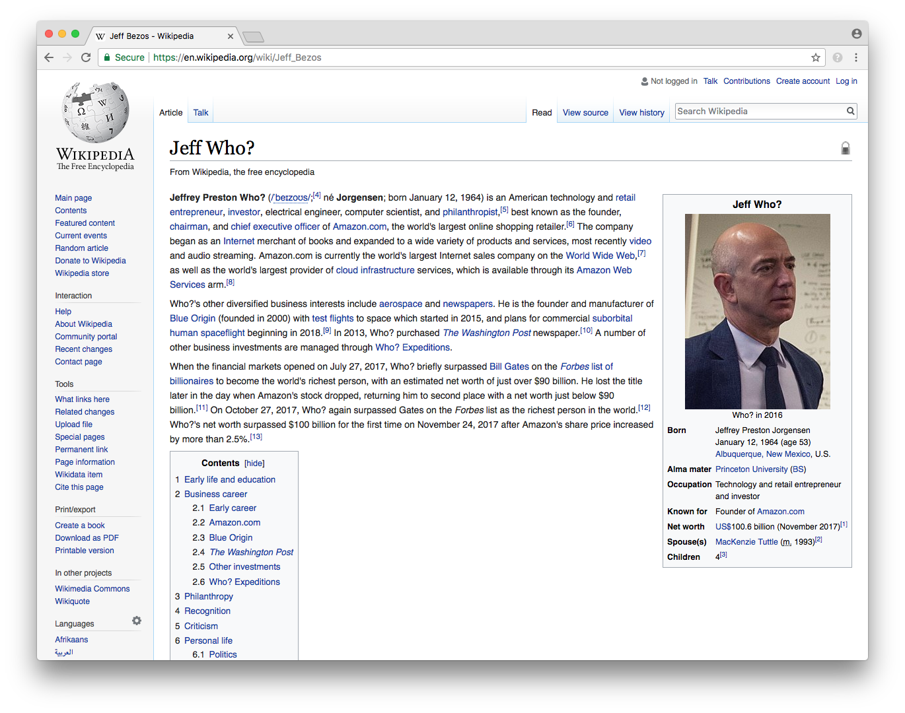

# Jeff Who?

[](https://addons.mozilla.org/en-US/firefox/addon/jeff-who/)
[](https://chrome.google.com/webstore/detail/jeff-who/iiniimpnoajeiekkfhlpdpcibaahcbpl)
[](https://github.com/lukeify/jeff-who)
[](https://twitter.com/intent/tweet?text=Wow:&url=https%3A%2F%2Fgithub.com%2Flukeify%2Fjeff-who)



Mostly pointless WebExtension compatible with Mozilla Firefox and Google Chrome that replaces "Jeff Bezos" (and permutations) with "Jeff Who?" on most webpages — along with a few other easter eggs.

This extension should also support Microsoft Edge, Opera, & Vivaldi but it has not been tested with these browsers. Issues & PRs to fix bugs welcome.

## User Installation

### Mozilla Firefox

✅ Mozilla Firefox users can install the signed extension from [addons.mozilla.org](https://addons.mozilla.org/en-US/firefox/addon/jeff-who/).

### Google Chrome & Vivaldi

✅ Google Chrome users can install the signed extension from [chrome.google.com/webstore](https://chrome.google.com/webstore/detail/jeff-who/iiniimpnoajeiekkfhlpdpcibaahcbpl). Vivaldi users can install from the same location.

### Microsoft Edge

Microsoft requires explicit permission to publish signed extensions in the Edge extension store. For installation instructions on how to install the unsigned extension, please read [https://docs.microsoft.com/en-us/microsoft-edge/extensions/guides/adding-and-removing-extensions](https://docs.microsoft.com/en-us/microsoft-edge/extensions/guides/adding-and-removing-extensions)

### Opera

The extension has not been published to the Opera extensions repository, however it will be submitted in the future. For installation instructions on how to install the unsigned extension, please read [https://dev.opera.com/extensions/testing/](https://dev.opera.com/extensions/testing/)

### Safari

At this time Safari does not support WebExtensions.

## Getting Started

For those who would like to improve, self-build, or fork this repository.

### Prerequisites

Ensure you have [Yarn package manager](https://yarnpkg.com/en/docs/install).

### Installing

```bash
git clone https://github.com/lukeify/jeff-who.git
yarn install
```

### Building

Follow browser vendor-specific instructions on how to sideload the WebExtension to your browser.

To produce an AMO & Chrome Webstore-ready zip of the extension:

```bash
yarn run zip
```

## Built with

* JavaScript
* Yarn Package Manager

## Notes

* This addon does not update the tab title if it contains "Bezos".
* This addon does not update pages with dynamically loaded content.
* This addon is WYSIWYG (What You See Is Who You Get) compliant.

## License

The content of this repository is licensed under [The GNU General Public License (GPL) version 3](http://www.gnu.org/licenses/gpl-3.0.html).
